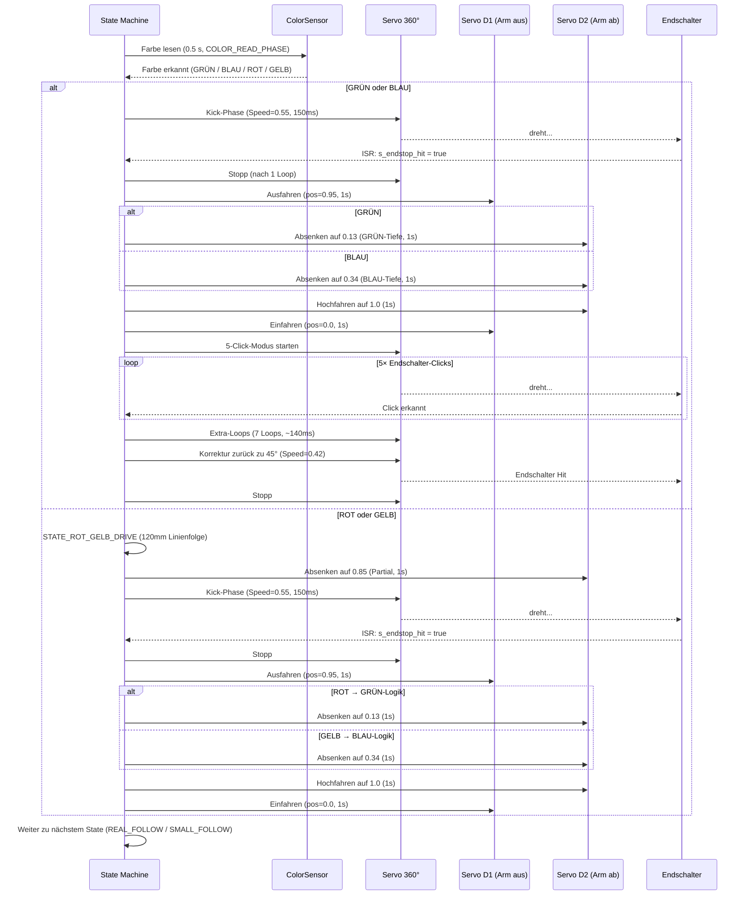

# CargoSweep — Servo-Sequenzdiagramm

> Gerendert automatisch auf GitHub. Zum Exportieren: [mermaid.live](https://mermaid.live) → Code einfügen → PNG/SVG herunterladen.

```mermaid
sequenceDiagram
    participant SM as State Machine
    participant CS as ColorSensor
    participant S360 as Servo 360°
    participant D1 as Servo D1 (Arm aus)
    participant D2 as Servo D2 (Arm ab)
    participant ES as Endschalter

    SM->>CS: Farbe lesen (0.5 s, COLOR_READ_PHASE)
    CS-->>SM: Farbe erkannt (GRÜN / BLAU / ROT / GELB)

    alt GRÜN oder BLAU
        SM->>S360: Kick-Phase (Speed=0.55, 150ms)
        S360-->>ES: dreht...
        ES-->>SM: ISR: s_endstop_hit = true
        SM->>S360: Stopp (nach 1 Loop)

        SM->>D1: Ausfahren (pos=0.95, 1s)

        alt GRÜN
            SM->>D2: Absenken auf 0.13 (GRÜN-Tiefe, 1s)
        else BLAU
            SM->>D2: Absenken auf 0.34 (BLAU-Tiefe, 1s)
        end

        SM->>D2: Hochfahren auf 1.0 (1s)
        SM->>D1: Einfahren (pos=0.0, 1s)

        SM->>S360: 5-Click-Modus starten
        loop 5× Endschalter-Clicks
            S360-->>ES: dreht...
            ES-->>SM: Click erkannt
        end
        SM->>S360: Extra-Loops (7 Loops, ~140ms)
        SM->>S360: Korrektur zurück zu 45° (Speed=0.42)
        S360-->>ES: Endschalter Hit
        SM->>S360: Stopp

    else ROT oder GELB
        SM->>SM: STATE_ROT_GELB_DRIVE (120mm Linienfolge)
        SM->>D2: Absenken auf 0.85 (Partial, 1s)
        SM->>S360: Kick-Phase (Speed=0.55, 150ms)
        S360-->>ES: dreht...
        ES-->>SM: ISR: s_endstop_hit = true
        SM->>S360: Stopp

        SM->>D1: Ausfahren (pos=0.95, 1s)

        alt ROT → GRÜN-Logik
            SM->>D2: Absenken auf 0.13 (1s)
        else GELB → BLAU-Logik
            SM->>D2: Absenken auf 0.34 (1s)
        end

        SM->>D2: Hochfahren auf 1.0 (1s)
        SM->>D1: Einfahren (pos=0.0, 1s)
    end

    SM->>SM: Weiter zu nächstem State (REAL_FOLLOW / SMALL_FOLLOW)
```
